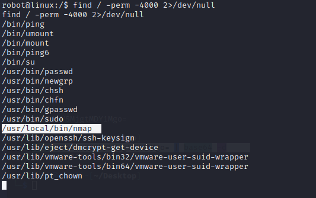

Mr Robot CTF
Victim IP - 10.10.155.227
VPN - 10.4.66.178

I start this box by commencing a `nmap -sV -A -T4 10.10.155.227` against the target.

The nmap scan has revealed ports 80 and 22 to be open.  This identifies that the IP has http and ssh traffic allowed to it.  Lets try navigate to `http://10.10.155.227`

Navigating to the gui of 10.10.155.227 reveals a CLI.  Typing `help` reveals command options.  Navigating through the options reveals nothing interesting, lets look for another vector.

As we learnt earlier that port 80/http is open.  Lets try curling the robots.txt file.

Curling the robots.txt file reveals some hidden files including the 1st key under `key-1-of-3.txt`

Entering the command `curl http://10.10.255.227/fsocity.dic -o fsocity.dic` retrieves the file and saves it locally on my kali machine as `fsocity.dic` 

Retrieving the file via terminal using `cat` reveals unsorted data.  Entering `sort  fsocity.disc > sorted_fsocity.dic`

Sorts this output data into alphabetical order and places them into an output file called `sorted_fsocity.dic`.

Entering `sort sorted_fsocity.dic | uniq > unique_fsocity.diq` removes the duplicates and places them into a new file called `unique_fsocity.dic`

This is essentially a wordlist that we can assume is either username or passwords.

We can now run gobuster against the URL to locate any hidden directories using the command `gobuster dir -u 10.10.155.227 -w /usr/share/wordlists/dirbuster/directory-list-2.3-medium.txt`

Gobuster reveals the /licence directory and that it is a wordpress site. 

Scrolling down reveals a hash key.

Entering this hash key in cyber chef reveals the hash key as `elliot:ER28-0652`

This can also be done via the terminal by entering `echo ZWxsaW90OkVSMjgtMDY1Mgo= | base64 -d`

Navigating to `http://10.10.155.227/wp-admin` reveals the worpdress login page. This is a useful sub-directory as all wordpress websites have this login page. Lets enter the credentials `elliot/ER28-0652`

Success! We are in.

Lets try enumerating and establishing shell access.

A useful wordpress exploit we can attempt is to inject malicious code into the 404 error template.  The 404 error page is a standard HTTP error message code that means the website attempting to be reached was unable to be found.  We can exploit this by injecting code into the 404 template and then purposely navigating to that 404 error page.

### To do this:

Select `Apperance > Editor > 404 Template` via the left hand plane.  This shows the 404 template and allows us to edit the code on the page.  Navigate to `www.revshells.com` and select PHP Pentestmonkey; this allows us to enter our kali box as a netcat listener to establish a reverse kali shell to the wordpress site.

I copy this text, paste it into the 404 template on the admin page and hit update.

Now I can fire up a netcat listener locally on my kali machine and purposely trigger this 404 page to establish a reverse shell.

After setting up the netcat listener I can navigate to `http://10.10.227.155/404.php` to establish a reverse shell connection to the website.

We now have established a reverse shell via netcat listener however it is not stable.

Entering `which python` reveals that python is installed and entering `python --version` reveals the version of python that is installed on the wordpress machine.

Entering the command `python -c 'import pty;pty.spawn("/bin/bash")'` allows for a more stable shell so our net cat listener doesn't drop.

Success! Now we have a stable shell.  Lets begin enumerating linux and poking around for the remaining flags.

Using a combination of `dir` and `cd` commands reveals the key-2-of-3.txt under `/home/robot/key-2-of-3.txt`

We cannot view the key 2 hash as we do not have permissions so lets attempt to retrieve the md5 hash.

Retrieving the `password.raw-md5` file which reveals it as `robot:c3fcd3d76192e4007dfb496cca67e13b`

We can use `https://crackstation.net` to decrypt the hash. It is `abcdefghijklmnopqrstuvwxyz`

Using this password we can enter root privileges in that directory via `su robot`

No we can retrieve the key 2 file via `cat key-2-of-3.txt`

Poking around the directories reveals that we do not have access to the /root directory.  Lets try enumerating this.

Searching for linux escalation via Hacktricks reveals we can attempt to execute the following command below to search for directories with a sudo bit enabled.  These directories can potentially be exploited for root access.

Executing the command  - `find / -perm -4000 2>/dev/null` reveals directors with sudo bits enabled.

The command reveals directors including the `/usr/local/bin/nmap` directory which if misconfigured can be exploited.  

Executing the command `nmap --interactive` reveals that nmap is running at version 3.81.  gtfobins reveals that versions 2.02 to 5.21 are vulnerable to shell escalation via the `!sh` command

Now that we have root access I want to check the root folder.  Navigating there and entering `dir` reveals key 3.  Using `cat` retrieves the key.

