Local IP - 10.4.65.102
Victim IP - 10.10.137.4

https://10-10-137-4.p.thmlabs.com

Navigating to the webpage above reveals multiple sub pages and directories
Inspecting the source code reveals a comment that appears to be another webpage under the directory `/new-home-beta`
Navigating here reveals the 1st flag.

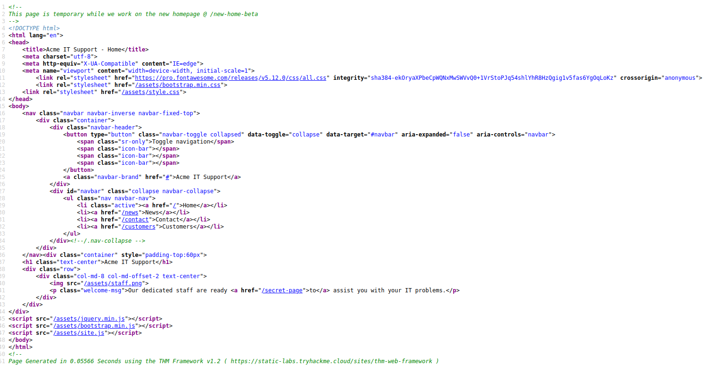
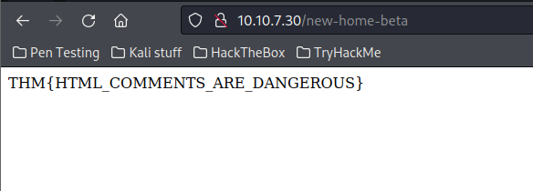

I continued to search through source code & located a "secret page" class.  Navigating to the webpage with the /secret-page added to the end reveals flag 2.

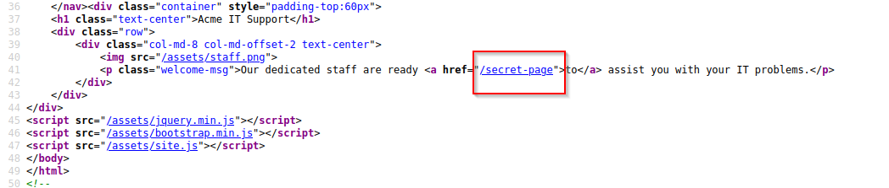
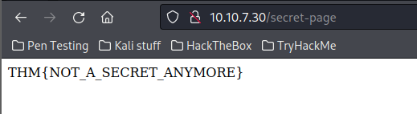

The source code also reveals an image called staff.png located under /assets.  Now I can attempt to navigate to the /assets directory.  I click on the image and remove staff.png from the URL and locate a hidden directory with a flag.txt file for flag 3.

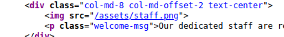
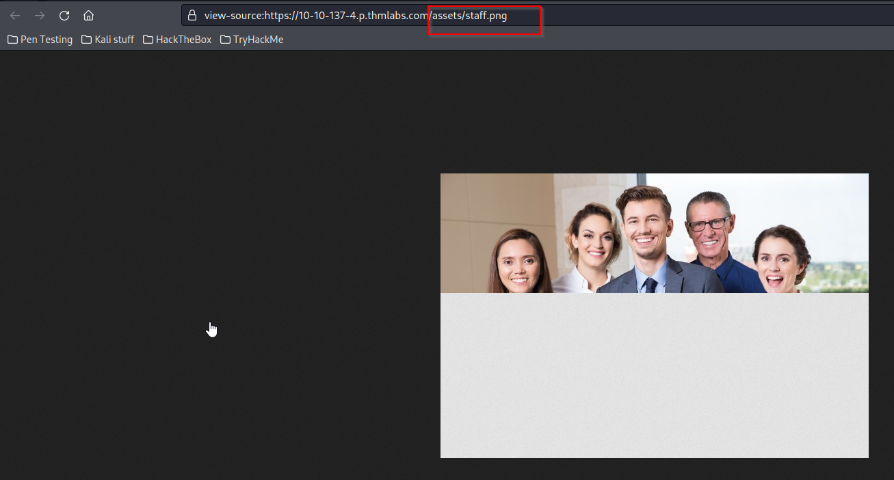
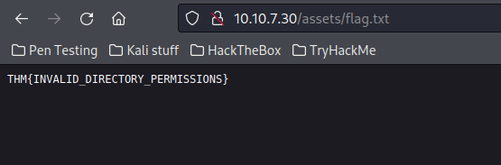

The source code also reveals a comment with another web page that reveals webpage with sub pages, home, change log and documentation.

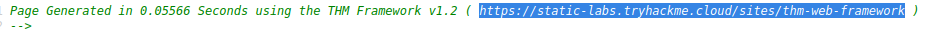
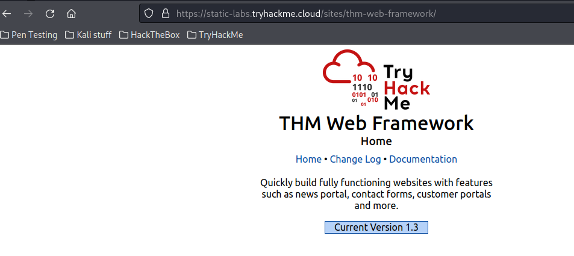

Navigating to Change log reveals a file in a web directory called /tmp.zip.  Altering the url to `https://10-10-137-4.p.thmlabs.com/tmp.zip` prompts to save a zip file.  Opening that reveals flag 4.

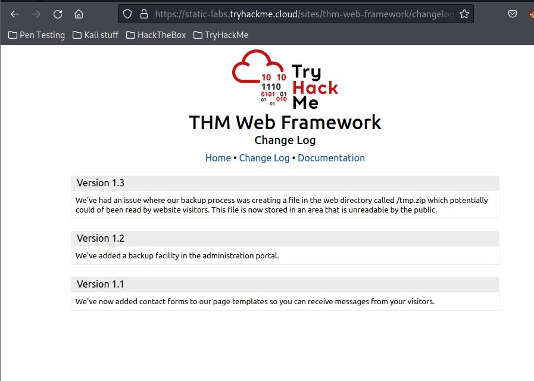
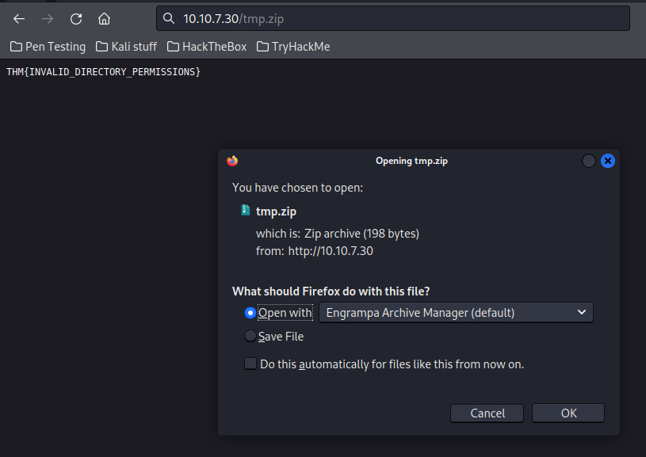

Inspecting the source code here reveals a line `
` which appears to block the display.  Changing this to `none` and refreshing the page reveals another flag.
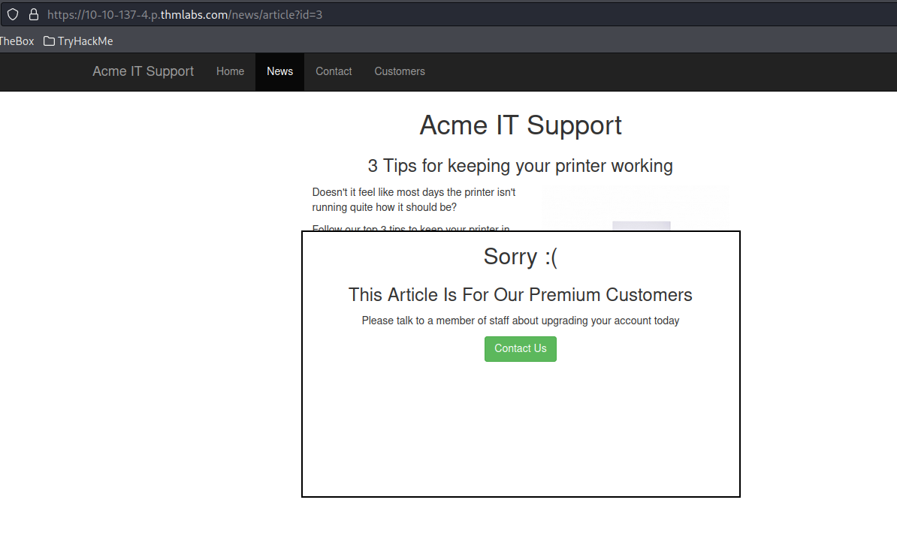
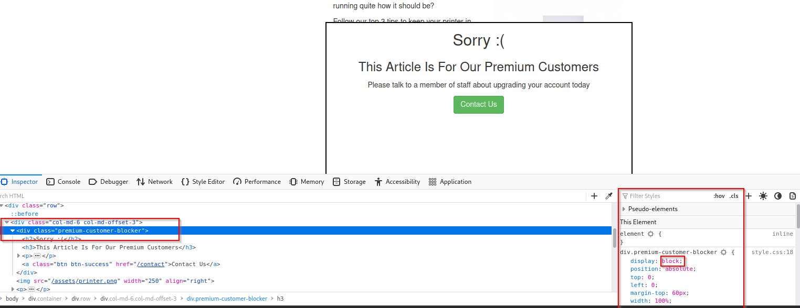
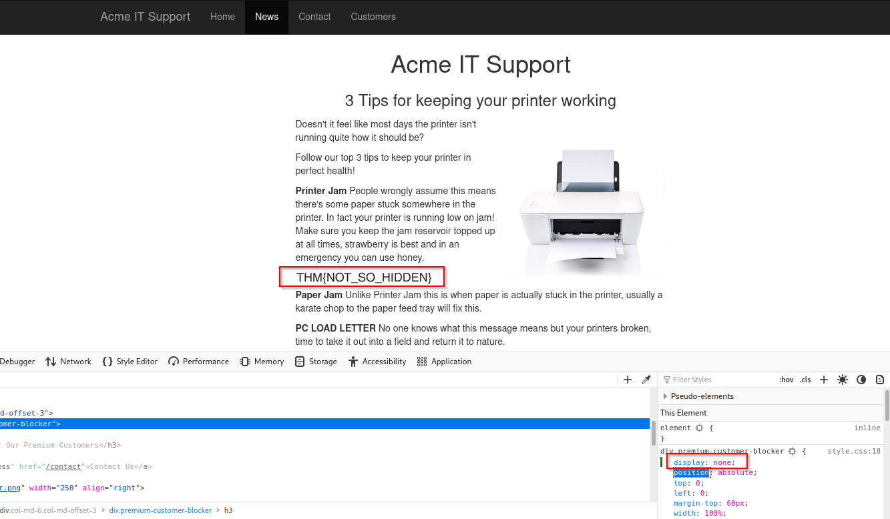

Navigating to the contact us page reveals a quick red blip.  Inspecting the page and identifying the code reveals a .js file being loaded from the assets directory we located earlier.  Inspecting this reveals a function on line 48 called `flash['remove']();`.  Within the debugging tool of the browser you can implement a "breakpoint" which stops code from executing.  I do this by clicking the line number and then I refresh the page and reveal the flag.

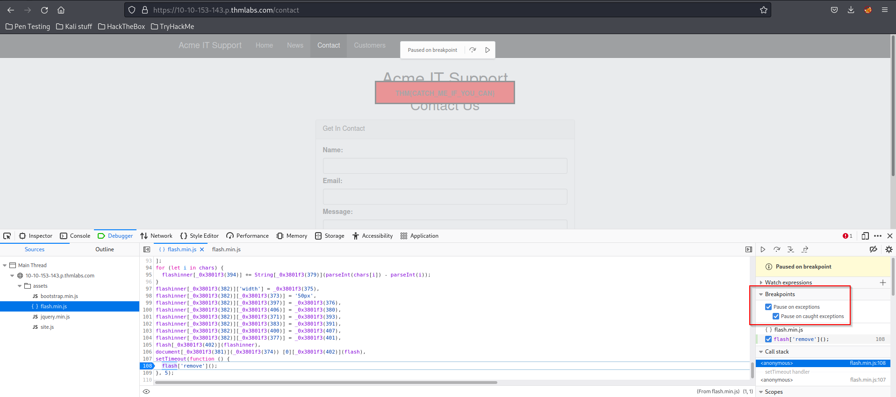

Back on the contact page I test input by entering random data into the contact us form and hit send as I have the network dev tool open.  This reveals a post 200 json method in the background which indicates the text I inputed is being sent somewhere.  Opening this reveals the final flag.

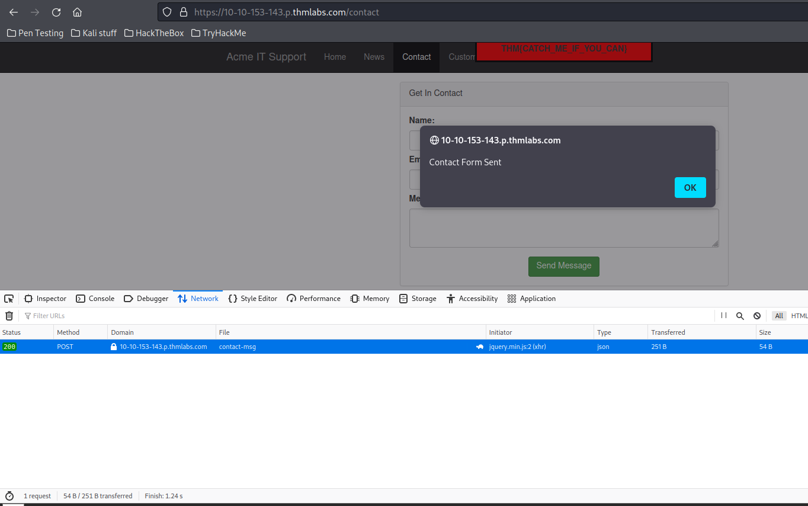
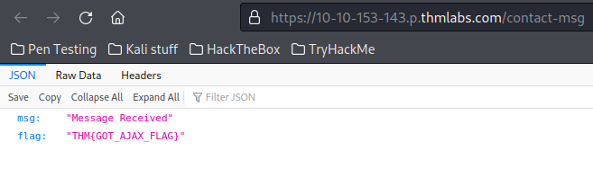